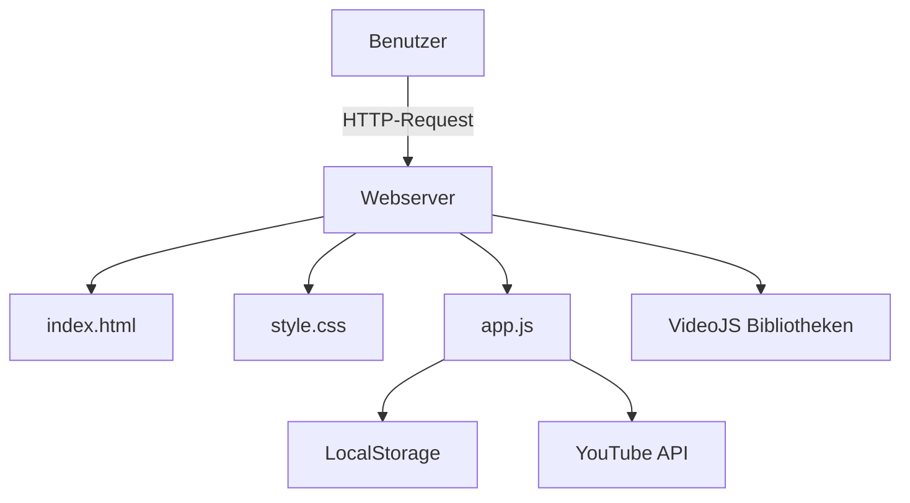
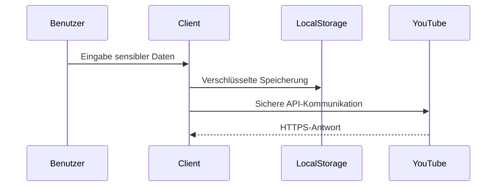

# Video Feedback Tool - Technische Dokumentation

## 1. Systemarchitektur


## 2. Technische Spezifikationen
- **Client-seitige Technologien**:
  - HTML5 Video-Player
  - Video.js Framework
  - LocalStorage für Persistenz
  - YouTube IFrame API

- **Browser Support**:
  - Chrome 80+
  - Firefox 75+
  - Edge 80+
  - Safari 13.1+

- **Performance**:
  - Ladezeit < 2s (3G)
  - Memory Usage < 150MB

## 3. Sicherheitskonzept


## 4. API-Referenz
### 4.1 Player-Funktionen
```javascript
/**
 * Lädt ein Video in den Player
 * @param {string} url - Video-URL (YouTube/MP4)
 */
function loadVideo(url) { ... }

/**
 * Fügt Kommentar mit Zeitstempel hinzu
 * @param {number} timestamp - Zeit in Sekunden
 * @param {string} comment - Kommentartext
 */
function addComment(timestamp, comment) { ... }
```

## 5. Deployment Checkliste
1. [ ] HTTPS konfigurieren
2. [ ] CORS-Header setzen
3. [ ] Cache-Control Header optimieren
4. [ ] Browser Feature Policy anpassen
5. [ ] Content Security Policy definieren

## 6. Wartungsprozesse
- Regelmäßige Bibliotheksupdates
```bash
npm outdated --depth=0
```
- Sicherheitsaudits
```bash
npm audit
```

## 7. Lizenzinformation
MIT License - Volltext in LICENSE.md